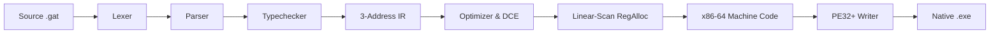

# The `gat` Programming Language

[](LICENSE)
[](#project-status)
[](#self-hosting-verification)
[](editors/vscode/)

`gat` is a compiled, low-level systems programming language featuring automatic reference counting (ARC), direct Windows x86-64 Portable Executable (PE32+) machine code emission, and a 100% bitwise-reproducible **self-hosted compiler**.

---

## Key Highlights

- **100% Self-Hosting**: The compiler (`src/compiler.gat`) is written entirely in `gat` and compiles itself, producing bitwise-identical binaries across all bootstrap stages (`stage2 == stage3 == stage4`).
- **Zero External Toolchain Dependencies**: Emits standalone Windows PE (`.exe`) binaries directly without linkers (like `link.exe` or `lld`), assemblers (like `nasm`), or C runtimes (`MSVCRT`).
- **Dual Memory Model**:
  - `struct`: Stack-allocated value types (zero heap or refcount overhead).
  - `class`: Heap-allocated reference types managed via non-atomic ARC.
  - `deinit`: RAII-style destructor hooks executed automatically when reference count reaches zero.
  - `weak T`: Non-owning weak references and `weak_upgrade` for deterministic cycle breaking.
  - `raw T`: Unsafe raw pointer escape hatch for memory buffers and low-level systems programming.
- **Borrowed-by-Default Calling Convention**: Function parameters are borrowed by default, eliminating redundant retain/release cycles on calls.
- **First-Class Functions**: First-class function pointers and function types (`fn(T1, T2) -> TRet`) supporting higher-order combinators (`map`, `filter`).
- **Native Concurrency**: OS threads (`std/thread.gat`) and synchronization (`std/sync.gat` `Mutex`) with compile-time thread-boundary reference isolation.
- **Linear-Scan Register Allocator & Optimizer**: Live-interval register allocator utilizing `RAX`, `RCX`, `RDX`, `R8`-`R14`, `RBX`, combined with constant folding, dead-code elimination (DCE), and ARC retain/release elision.
- **Package Manager & Namespaces**: Minimal manifest (`gat.mod`), lockfile (`gat.lock`), Git dependency resolution (`gat fetch`), and collision-free namespaced imports (`import "..." as pkg;`).
- **Language Server (LSP)**: First-party Language Server Protocol (LSP 3.17) implementation and VS Code extension with real-time compiler diagnostics, go-to-definition, hover, and document symbols.

---

## Quick Start

### 1. Clone the Repository
The repository ships with pre-built self-hosting seed binaries (`bin/gatc.exe` and `bin/gat.exe`), allowing immediate compilation with zero setup:

```powershell
git clone https://github.com/DanielcoderX/gat.git
cd gat
```

### 2. Run a Program
Execute any `.gat` file directly with the CLI tool:

```powershell
.\bin\gat.exe run examples\hello.gat
```

### 3. Compile to Standalone Native Executable
Compile source code directly into a native `.exe` binary (Windows PE) or static ELF64 binary (Linux):

```powershell
# Windows (default)
.\bin\gat.exe build examples\hello.gat -o hello.exe
.\hello.exe

# Linux ELF64 (Direct Syscalls, zero libc/linker dependencies)
.\bin\gat.exe build examples\hello.gat -o hello_linux --target=linux
wsl chmod +x ./hello_linux ; wsl ./hello_linux
```

### 4. Fast Semantic & Type Check
Perform fast type checking and diagnostic inspection without emitting binaries:

```powershell
.\bin\gat.exe check examples\hello.gat
```

### 5. Rebuilding the Self-Hosting Compiler
To recompile the `gat` compiler from source using the compiler itself:

```powershell
.\bin\gatc.exe src\compiler.gat -o bin\gatc.exe
.\bin\gatc.exe cli\gat.gat -o bin\gat.exe
```

### 6. Run the Full Test Suite & Bootstrap Verification
Verify all 23 language test suites, diagnostic negative tests, LSP verification, WSL Linux direct syscall test suite, and 3-stage bitwise identity:

```powershell
powershell -ExecutionPolicy Bypass -File .\test.ps1
```

---

## Project Status & Design Boundaries

- **Cross-Platform Target Architecture**:
  - **Windows x86-64 (PE32+)**: Direct PE executable emission using `KERNEL32.dll` dynamic imports.
  - **Linux x86-64 (ELF64)**: Direct static ELF executable emission using raw x86-64 direct kernel syscalls (`sys_write`, `sys_mmap`, `sys_open`, `sys_read`, `sys_close`, `sys_nanosleep`, `sys_fork`, `sys_execve`, `sys_wait4`, `sys_clone`, `sys_exit`). Zero external libc or linker dependency.
- **Memory Safety & ARC**: Single-threaded heaps utilize zero-overhead non-atomic ARC. Reference-counted types (`class`, `string`, `weak T`) are forbidden at compile time from crossing thread boundaries.
- **Concurrency**: Native OS threads communicate through value types, raw memory buffers (`raw T`), and `Mutex` critical sections.
- **Generics**: Uniform 64-bit word-sized type erasure model for generic classes (`class Vector<T>`) and functions.
- **Package Management**: Decentralized Git-based dependency fetching directly from source repositories (e.g. `github.com/...`) and local paths.

---

## Language Overview

### Types

| Type | Kind | Size (Bytes) | Description |
| :--- | :--- | :--- | :--- |
| `i64` | Primitive | 8 | 64-bit signed two's complement integer |
| `i8` | Primitive | 1 | 8-bit signed integer / ASCII byte |
| `bool` | Primitive | 8 | Boolean (`true`, `false`) |
| `string` | Reference | 8 | Null-terminated string buffer |
| `void` | Unit | 0 | Unit return type |
| `raw T` | Pointer | 8 | Unsafe raw memory pointer (e.g. `raw i8`, `raw Point`) |
| `weak T` | Weak Ref | 8 | Non-owning reference for breaking ARC cycles |
| `fn(...) -> Ret`| Function | 8 | First-class function pointer |
| `struct S` | Value | Sum of fields | Stack-allocated value aggregate |
| `class C` | Reference | 8 (Heap) | ARC heap-allocated class with optional `deinit` |

---

### Code Examples

#### Hello World & String Interpolation
```gat
fn main() -> i64 {
    let name = "World";
    print("Hello, {name}!\n");
    return 0;
}
```

#### Structs (Value Types) & Classes (ARC Reference Types)
```gat
struct Point {
    x: i64;
    y: i64;
}

class Buffer {
    data: raw i8;
    size: i64;

    deinit {
        if self.data != nil {
            free_mem(self.data);
            self.data = nil;
        }
    }
}

fn make_buffer(sz: i64) -> Buffer {
    let buf: raw i8 = alloc_mem(sz);
    return new Buffer {
        data: buf,
        size: sz
    };
}
```

#### Weak References & Cycle Breaking (`weak T`)
```gat
import "std/weak.gat";
import "std/option.gat";

class Node {
    value: i64;
    next: Node;
    prev: weak Node; // Weak back-pointer prevents reference cycle leak
}

fn create_linked_pair() {
    let n1 = new Node { value: 1, next: nil, prev: nil };
    let n2 = new Node { value: 2, next: nil, prev: weak_from(n1) };
    n1.next = n2;
}
```

#### First-Class Functions
```gat
fn apply(f: fn(i64, i64) -> i64, a: i64, b: i64) -> i64 {
    return f(a, b);
}

fn add(x: i64, y: i64) -> i64 {
    return x + y;
}

fn main() -> i64 {
    let res = apply(add, 20, 22);
    print("Result: {res}\n"); // 42
    return 0;
}
```

#### Native Threads & Synchronization
```gat
import "std/thread.gat";
import "std/sync.gat";

struct Task {
    counter: raw i64;
    mtx: Mutex;
}

fn worker(t: raw Task) {
    mutex_lock(t.mtx);
    t.counter[0] = t.counter[0] + 1;
    mutex_unlock(t.mtx);
}

fn main() -> i64 {
    let m = mutex_new();
    let count: raw i64 = alloc_mem(8);
    count[0] = 0;

    let t = new Task { counter: count, mtx: m };
    let h1 = thread_spawn(worker, raw t);
    let h2 = thread_spawn(worker, raw t);

    thread_join(h1);
    thread_join(h2);

    print("Counter: {count[0]}\n"); // 2
    return 0;
}
```

#### Standard Library Modules & Namespaces
```gat
import "std/str.gat";
import "std/fs.gat";
import "std/vec.gat";
import "std/map.gat";

// Namespaced module import
import "examples/modules/pkg_a/lib.gat" as math_pkg;

fn main() -> i64 {
    let sb = sb_new(64);
    sb_append(sb, "Gat ");
    sb_append(sb, "Toolchain");
    let s = sb_to_string(sb);

    let v = vec_new();
    vec_push(v, 100);
    vec_push(v, 200);

    let val = math_pkg.compute(5);
    return 0;
}
```

---

## Package Manager (`gat.mod`)

Gat projects declare dependencies in `gat.mod`:

```
module my_app

require github.com/user/gat-json v1.0.0
require ./local_packages/math_lib v0.1.0
```

- Initialize a project: `gat init my_app`
- Fetch & cache dependencies: `gat fetch` (generates `gat.lock` and populates `.gat/deps/`)
- See [docs/MODULES.md](docs/MODULES.md) for full module and package management documentation.

---

## Editor Support (VS Code & LSP)

An official Visual Studio Code extension and standalone Language Server Protocol (LSP 3.17) server are included in `editors/vscode/`:
- **Features**: Syntax highlighting, real-time compiler error squiggles, go-to-definition, hover documentation, document symbols outline, and snippets.
- **Install**: Link `editors/vscode/` into `%USERPROFILE%\.vscode\extensions\gat-language`.
- See [editors/vscode/README.md](editors/vscode/README.md) for details.

---

## Self-Hosting Verification & Architecture

The `gat` compiler is 100% self-hosted and emits native machine code directly:



### 3-Stage Bitwise Identity Verification
To confirm that compiler builds are 100% deterministic and reproducible:

```powershell
# 1. Compile compiler with seed binary -> stage2
.\bin\gatc.exe src\compiler.gat -o bin\gatc-stage2.exe

# 2. Compile compiler with stage2 binary -> stage3
.\bin\gatc-stage2.exe src\compiler.gat -o bin\gatc-stage3.exe

# 3. Compile compiler with stage3 binary -> stage4
.\bin\gatc-stage3.exe src\compiler.gat -o bin\gatc-stage4.exe

# 4. Compare bitwise equality across all stages
fc.exe /b bin\gatc-stage2.exe bin\gatc-stage3.exe
fc.exe /b bin\gatc-stage3.exe bin\gatc-stage4.exe
```

---

## Documentation

- [Language Specification](docs/LANGUAGE_SPEC.md): Full syntax, memory model, and typing rules.
- [Modules & Package Manager](docs/MODULES.md): Namespaced imports, manifest format, and dependency fetching.
- [GitHub Setup & Contributing](docs/GITHUB_SETUP.md): Repository metadata, CI configuration, and release workflow.

---

## License

This project is licensed under the [MIT License](LICENSE).
